---

## title: '「AWSコンテナ設計本格入門」を読む'

description: 'AWS'
pubDate: 'May 22 2025'
heroImage: '../../assets/blog-placeholder-1.jpg'
tags: ['AWS']
category: 'books'

### Chapter 01 コンテナの概要

- オーケストレーションのメリット
  - 可用性、パフォーマンス向上など

### Chapter 02 コンテナ設計に必要なAWSの基礎知識

#### 2-1 AWSが提供するコンテナサービス

- ECSはフルマネージド、99.99%
- タスク定義はJSONで記述
  - タスク、コンテナイメージ、リソース、IAMロール、CloudwatchLogsの出力など
  - 複数のコンテナを含められる
- サービス
  - 必要な数のタスクを維持する、オーケストレータのコア部分
  - タスク数やLB、ネットワークを指定して作成する  
  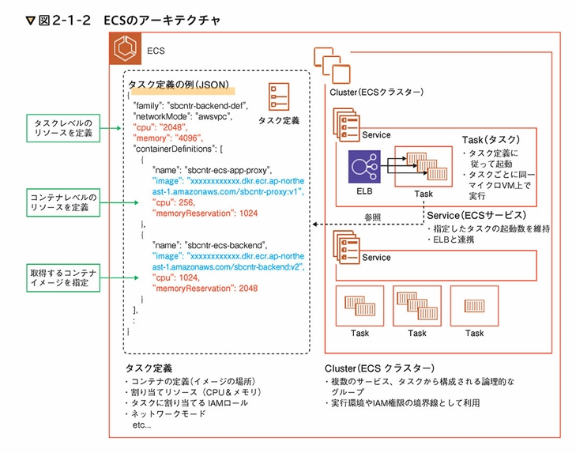
- データプレーン
  - EC2
    - CPU、メモリ、ストレージを変更できる
    - 柔軟性を求める場合はEC2を選択することも可能
  - Fargate
    - 単体では利用できない
    - 少し高いが、TCOでは有利  
    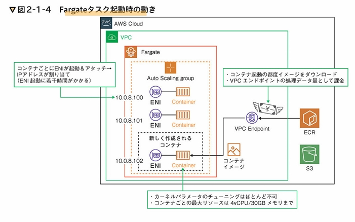
  - Lambda
    - メモリとIAM権限を意識
    - Lambdaで実現難しい場合はECSやEC2のみで構成など
  - AppRunner
    - GitHubと連携してコードをビルドやデプロイできる
    - ECRのコンテナイメージも即時デプロイできる
    - すぐにデプロイできる
    - Fargateを使う場合は、NET、LBなどが必要になるが、AppRunnerは強力な選択肢

#### 2-2 アーキテクチャの構成例

- ECS + Fargate
  - セキュリティ基準のPCIDSSに準拠
  - デプロイは遅い
    - コンテナごとにENIがアタッチされるため
    - イメージキャッシュができないため
      - コンテナイメージの取得には時間がかかる
    - エフェメラルステージは200GB、EFSを利用する手段もある
    - ECSExecでコマンドを実行可能  
    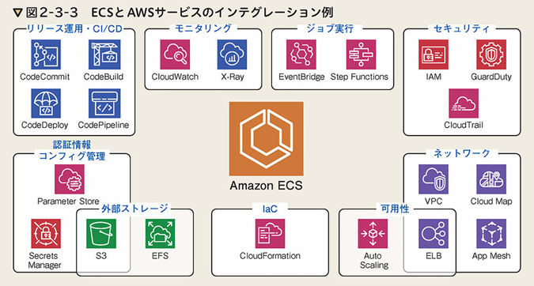
- 

#### 2-3 各アーキテクチャに適応したユースケース

#### 2-4 AWSでコンテナを利用する優位性

### Chapter 03 コンテナを利用したAWSアーキテクチャ

#### 3-2 WellArchitectedフレームワーク

- 運用上の優秀性、セキュリティ、信頼性、パフォーマンス、コスト最適化の5つ
  
#### 3-3 設計対象とするアーキテクチャ
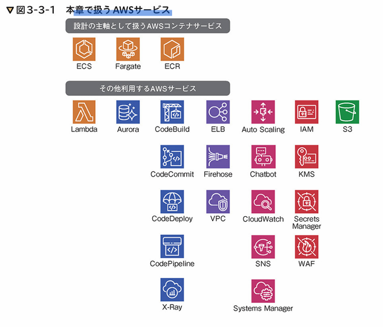

- 可用性を高めるためにマルチAZを基本
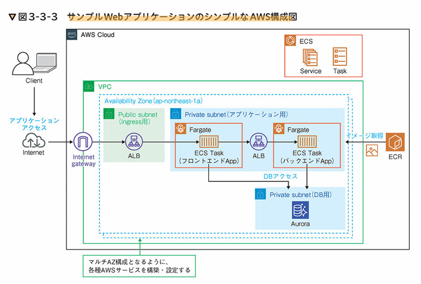

#### 3-4 運用設計
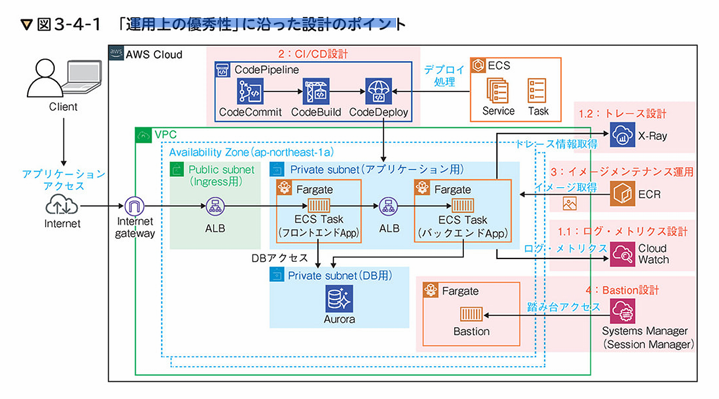

- モニタリングとオブザーバビリティの重要性
  - システムの可用性の維持のため
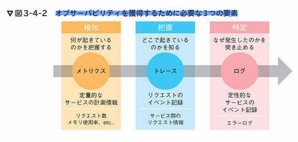

- CloudwatchLogsやFirelens
- トレースはX-Ray
- メトリクスは何を使うべきか

**ロギング設計**
  - CloudwatchLogsと連携し、LambdaやSNS連携などができる
  - サブスクリプションフィルター
    - 特定の文字列のみのログを抽出できる
    - 抽出したログのみをLambdaの連携→SNS通知など
  - 保持期間を設定できる
  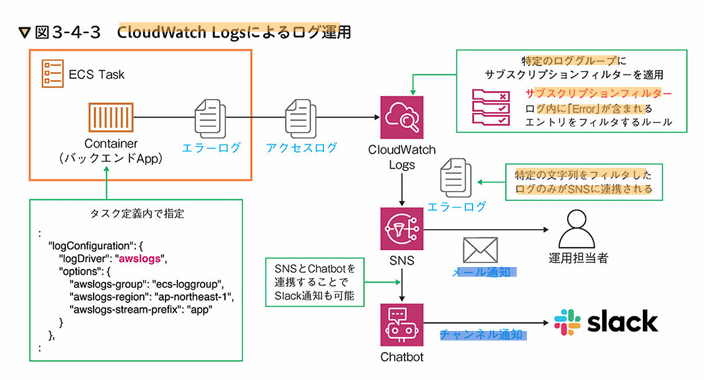
- 大量ログでなければCloudwatchLogsのみで十分

- FireLens
  - AWSサービスやSaaSへのログ転送のしやすさ
  - FluentdやFluentBit
  - サイドカー構成
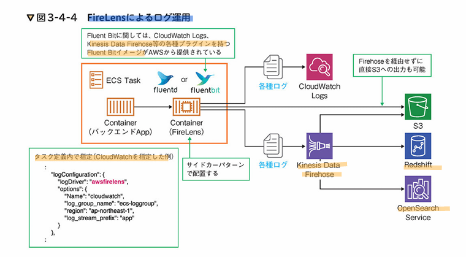

- RedshiftやOpensearchを使う場合はFireLens
- S3だけでなく、Cloudwatchにも同時に転送できる
  
- ログ運用デザイン
  - ログ長期保管目的でアクセスログはS3に、エラーログはCloudwatchLogsに転送したい場合
      - CloudwatchLogsからS3にエキスポートする方法
      - サブスクリプションフィルター→Firehose→S3など
      - 同時ログ転送の場合はFluentBitがよい
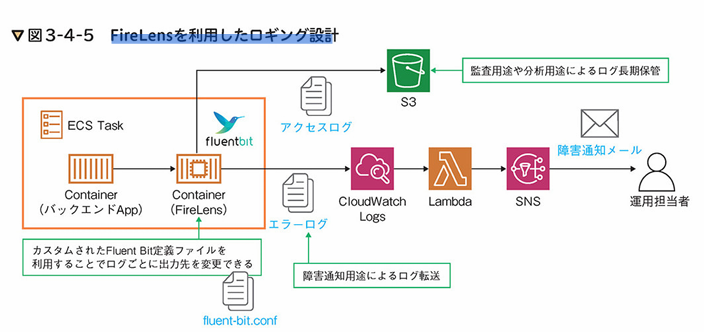

- ログ種類、内容、保持期間、分析方法などで考える

**メトリクス設計**
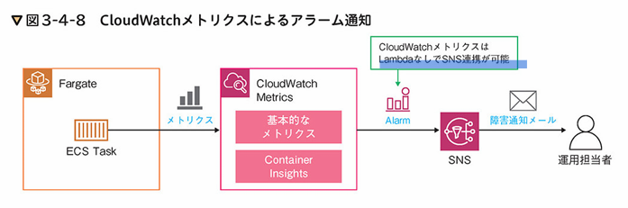

- CloudwatchMetrics
  - CPU, メモリ
  - あくまでサービス単位、タスクごとの情報は表示できない
- Cloudwatch container insights
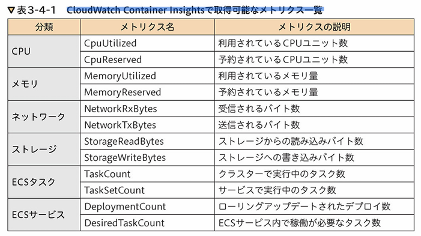
  - ダッシュボードも表示できる
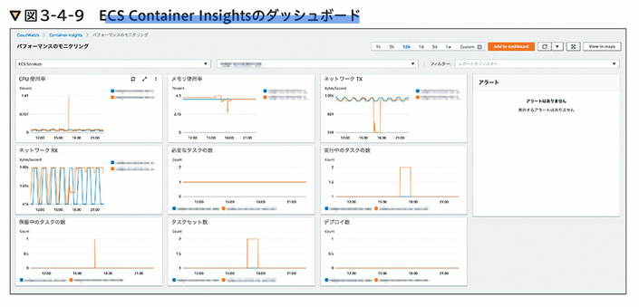
  - ただし、コスト対象になる

**トレース設計**
- X-Rayではサービスマップのダッシュボードも存在する
- サイドカー構成
- x-raySDKでトレース情報を送れる
- AWSXRayDaemonWriteAccess IAMロールが必要
  - ECSタスクロールへの権限付与が必要
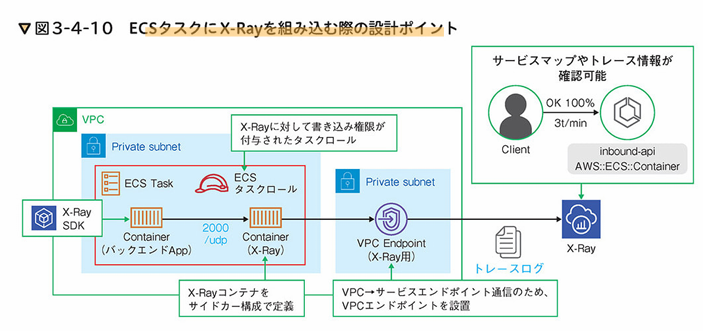

**CI/CD**
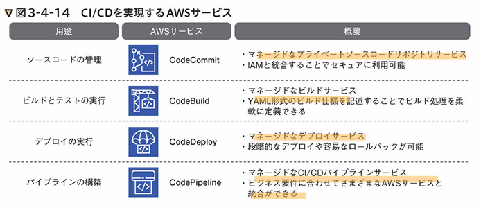

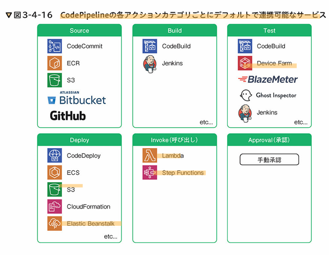

- マルチアカウント構成が一般的
  - リソースを確実に分離できる
  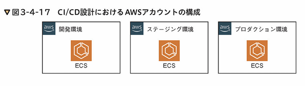
- CodeCommitは共有リソースとして管理
  - 環境ごとのブランチを用意
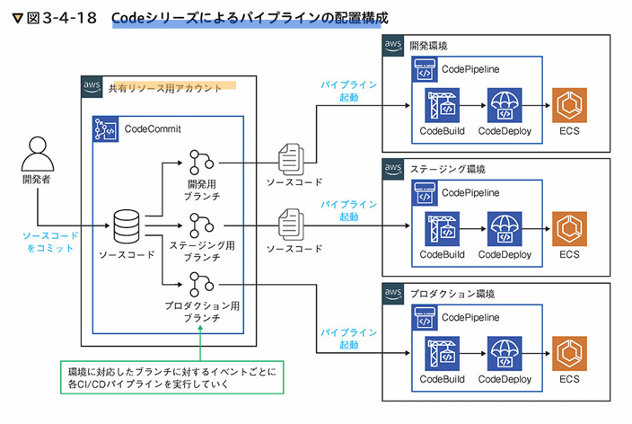
  - ECRも共通リソースに用意
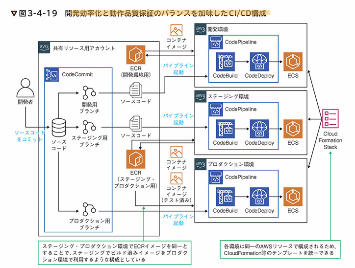 
- ブランチ戦略はGit flow, GitHub flowなど

- イメージのメンテナンス運用
  - コンテナイメージはS3に保存されるのでバックアップは不要
  - コンテナのライフサイクルポリシー
    - 一定期間のみ保存、世代分のみ保存など
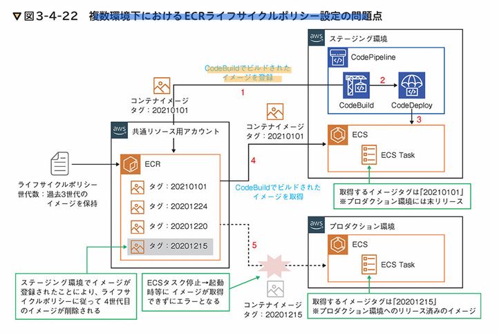
  - ライフサイクルが環境間で異なっているため発生する
  - コンテナイメージに複数のタグをつけることができる
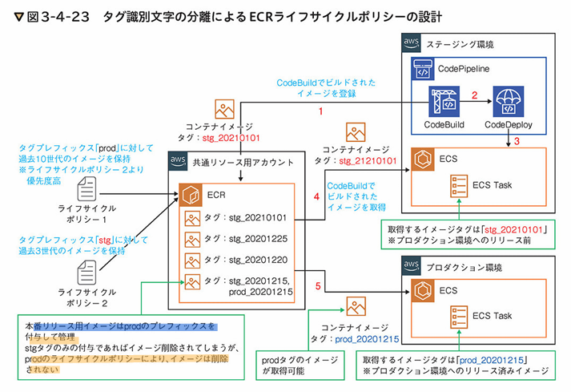

**Bastion設計**
- ホスト内にSSMエージェントをインストール＋IAM権限でアクセス
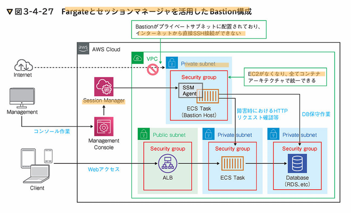

#### 3-5 セキュリティ設計

- NIST SP800-190
  - コンテナのベストプラクティス
  - イメージ、レジストリ、オーケストレータ、コンテナ、ホスト
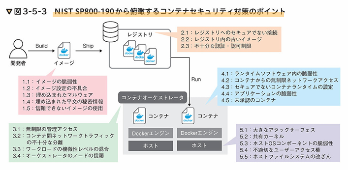

p127
#### 3-6 データベースの構築

#### 3-7 アプリケーション間の疎通確認

### Chapter 04 コンテナを構築する(基礎編)

#### 4-1 ハンズオンで作成するAWS構成

#### 4-2 ネットワークの構築

#### 4-3 アプリケーションの構築

#### 4-4 コンテナレジストリの構築

#### 4-5 オーケストレータの構築

#### 4-6 データベースの構築

#### 4-7 アプリケーション間の疎通確認

### Chapter 05 コンテナを構築する（実践編)

#### 5-1 ハンズオンで構築するAWS構成

#### 5-2 運用設計：Codeシリーズを使ったCI/CD

#### 5-3 運用設計&セキュリティ設計：アプリケーションイメージへの追加設定

#### 5-4 パフォーマンス設計：水平スケールによる可用性向上

#### 5-5 セキュリティ設計：アプリケーションへの不正アクセス防止

#### 5-6 運用設計&セキュリティ設計：ログ収集基盤の構築

#### 5-7 運用設計：FargateによるBastion（踏み台ホスト）の構築

#### 5-8 セキュリティ設計：Trivy/Dockleによるセキュリティチェック

