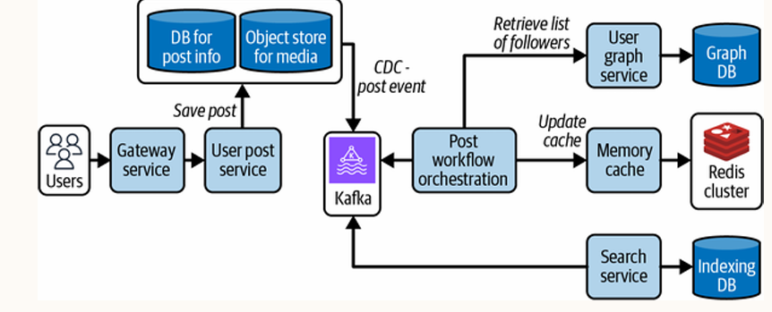
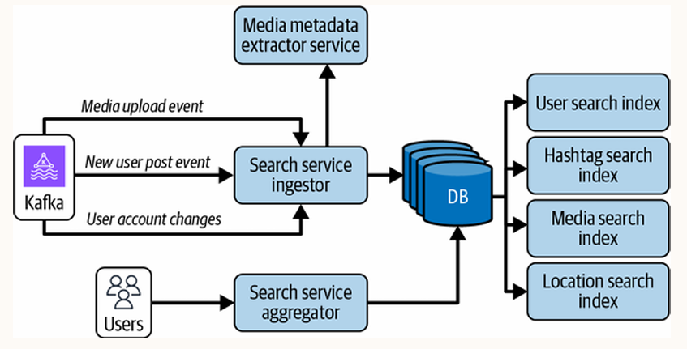
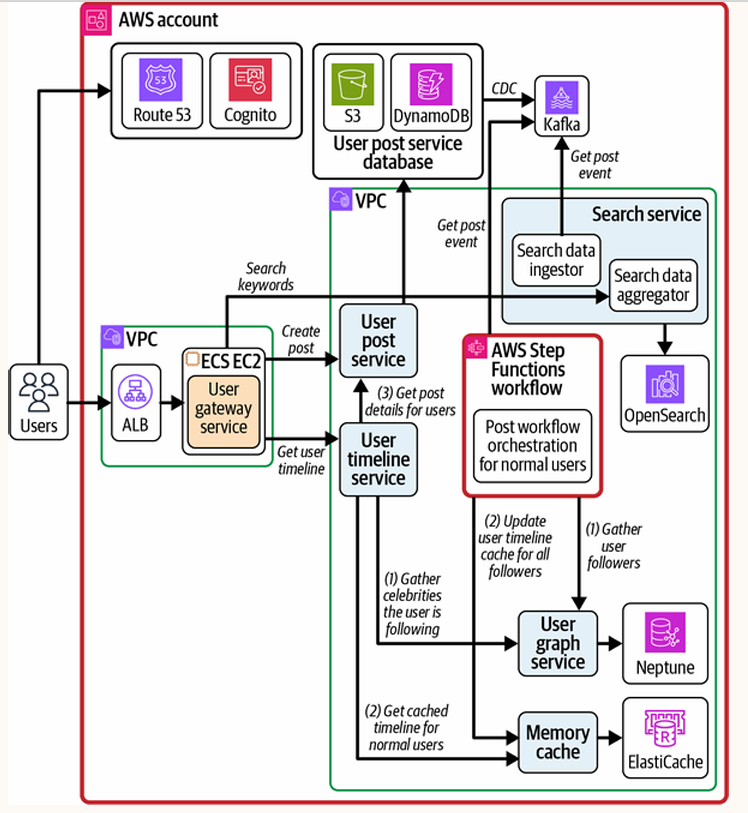
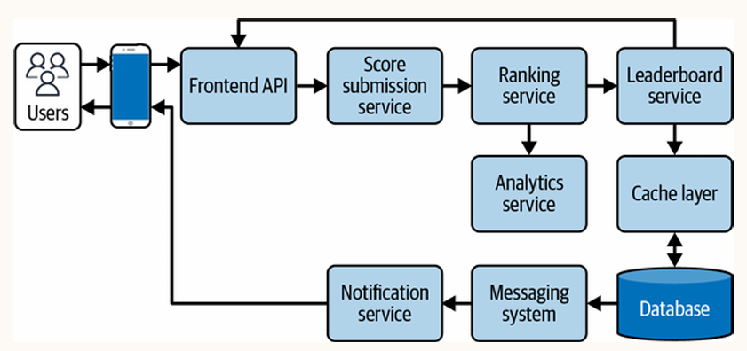
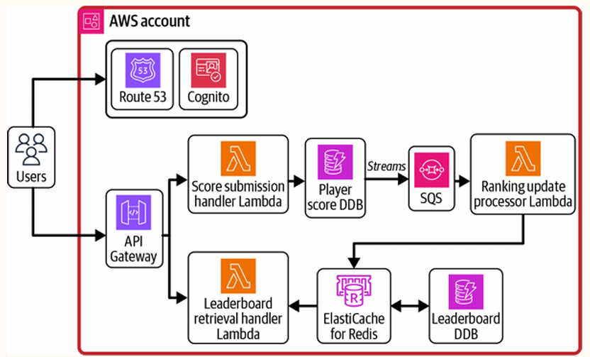
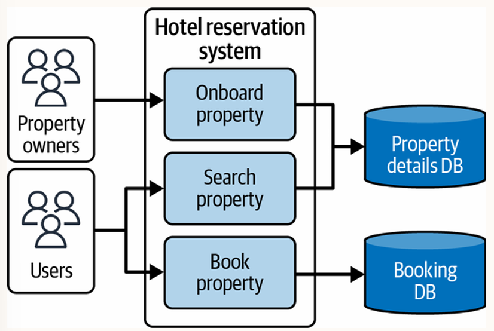
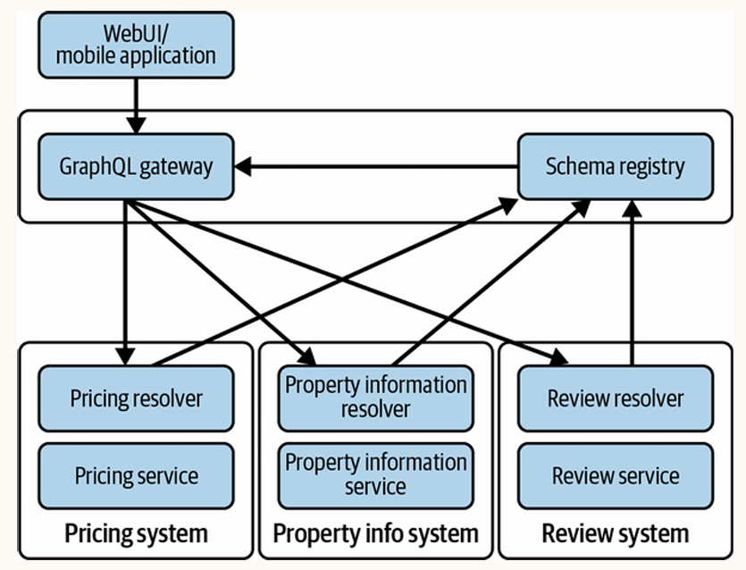
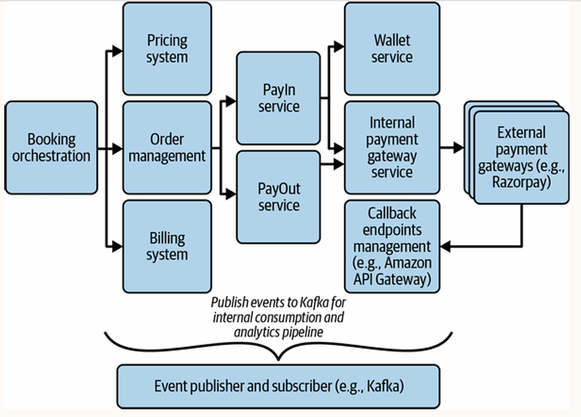
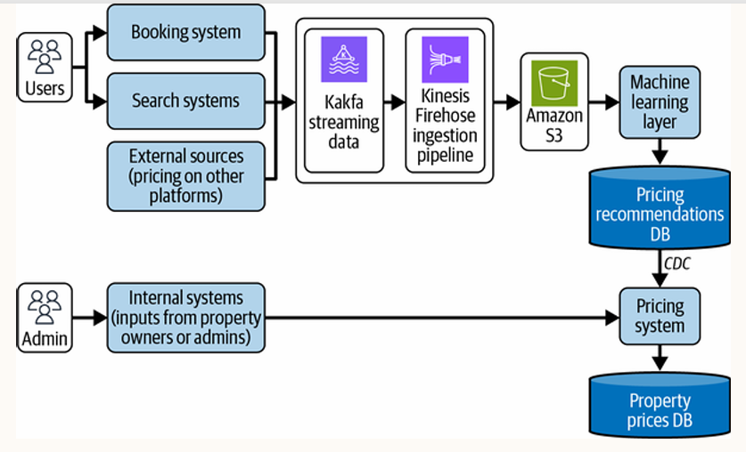

オライリーの`AWS上のシステム設計`という書籍を読んだので、気になったことを中心に簡単な感想や要約を書きます。(網羅性はありません)

この本は大きく３部に分かれていて、第一部ではクラウドでのシステム設計について、第二部ではAWSサービスについて、そして第三部ではケーススタディについて書かれています。

第一部と第二部は基本的な内容が多いので読んでいて少し退屈に感じましたが、第三部は非常に参考になり、興味深かったです。この章では、サンプルプロジェクトをもとに、NFR(非機能要件)で具体的な数値(RFPなど)を計算し、それを満たすAWSサービスを比較しています。


---

**サイト**

- <a href="https://www.oreilly.com/library/view/aws/9798341634060/">オライリー</a>

---

## 第一部　システム設計について
<!--
### 4. キャッシュポリシーと戦略

### 5. LBのアプローチとテクニック
-->


## 第二部　AWS上のサービス
<!--
### 12. メッセージング、モニタリングなど
-->


## 第三部　システム設計の使用例

### 14. URL短縮サービス

- この章ではURL短縮サービスを作成
    - 長いURLに対応する短いURLを作成するサービスのこと
    - 例えば、LinkeredInは投稿のURLを自動的に短縮する
        - 読みやすさのため

#### システム要件

**考えるべきこと**
- このシステムが解決するユースケース
- ユーザー数
- 既存のシステムが既に存在するか
    - もし存在すれば、独自システム構築に意味はない 
- システムの遅延が重要か

##### 機能要件と非機能要件

- 長いURLにリダイレクトさせる必要
- URLに有効期限を設定する必要

##### システム規模

**考えるべき指標**
- RPS(req per sec), QPS(query per sec)
- 長いURLにリダイレクトするユーザー数
    - 平均負荷とピーク時の負荷
- 必要なストレージ容量

**今回の仮定**
- 長いURLから短いURLを生成:1,000 RPS
- 短縮 URL から長い URL へのリダイレクト: 20,000 RPS
- システム内でのURL永続化の平均期間:1年

**スケールで考えるべきこと**
- Auroraなどを使う場合の予想されるコスト
- 最初からパーティション分割は必要か
- EC2インスタンスの種類や数
- Lambdaのメモリ要件 
- システム負荷テスト

##### 収納スペース

- 1年間の生成されるURLの求め方
    - (1,000リクエスト/秒)× 60(1分あたり)×60(1時間あたり)×24(1日あたり)×365(年間)~315億3000万
- URLの理想的な長さ
    - 安全のために15文字などでは長くなるので意味がない
    - 60文字を使う場合、60^7=3.5兆でよい

- 必要なDB容量の求め方
    - 短縮URL=7バイト
    - 長いURL=100バイト程度
    - メタデータは1KBなどと大きい

- 一個のURLにつき1KBと考える
- 1年間の合計ストレージ数
    - 315 億 3,000 万× 1 KB = 29.37 TB

DBの容量計算について今まで考えたことがありませんでしたが参考になりました。大雑把ではありますが、RPSやデータごとのバイト数を考えれば、一年間のデータ容量が計算できると分かりました。

#### デザインから始める

##### URL短縮アルゴリズム

##### システムAPI

```plaintext
POST /v1/createShortUrl
{
     longUrl,
     customUrl,
     expiry,
     userMetadata
}
```
- `expiry`などはクライアント側でも指定できるほうが柔軟性が高い
- `Metadata`はIP、地理情報、ブラウザなど
    - 分析に役立つ

このようにオプションをクライアントで柔軟に指定できるようにする手法は「APIデザインパターン」という書籍でも紹介されていました。

メタデータに関しては、ヘッダーから取得するか、DBではなくログに保存するかなども考える必要がありそうです。

##### システムに関する考察

##### データベースの選択

- RDBの場合は最初から論理パーティション戦略がお勧め
- DynamoDBの特徴
    - TTL設定
    - 読み取り、書き込みのスケールアップの心配なし
    - DynamoDBストリーム
        - これは分析にも役立つ
- DynamoDBのほうがRDBよりすぐに利用できることが多い
    
個人的にRDB→NoSQLへの移行が主流だと思っていたが、システムの成長につれてRDBへ移行することも多いと知りました。NoSQLは柔軟性だけでなく、すぐに使い始められるのも大きな利点だと思いました。

**Dynamoのスケーリング**
- オンデマンド容量モードから始めるのが分かりやすい
    - トラフィックパターンを把握
- 把握出来たらプロビジョニングモードへ移行
    - RCU(read cap unit), WCU(write cap unit)を考える

**DynamoDBの設計**
- PK {userId}
- ソートキー SU
    - 定数文字列を定義し、ソートキーの定義をスキップできる
    - これは推奨される手法

- ユーザーが作成した全てのURLを取得
    - GSIが必要
    - PK {userId}
    - SK u#{timestamp}

DynamoDBは使いたいクエリが増えた場合、GSIやLSIをその都度作成する必要があるので複雑なデータの場合は面倒になりそうです。

##### カスタム・ドメイン・サポート

#### AWS上でシステムを起動する

##### デイ・ゼロ・アーキテクチャ

**EC2**
- 最初から1000万人を考えるのは意味がない
- 最初はDBなども含めたEC2みたいな構成でも問題ない
    - けど流石にLB、MAZくらいは導入すべき

**Lambda**
- URL短縮Lambda, リダイレクト用Lambda

**App Runner**
- VPC内のすべてのリソースを起動

EC2で`docker-compose`などを使い、ウェブサーバやDBサーバを同じマシンで動かすのは本番環境では非推奨だと思っていましたが、クラウド移植性はいいですし、初期段階なら悪くないように感じました。

##### 数百万人、そしてそれ以上へのスケーリング

**オブザーバビリティを高める**
- アラームの例
- LONG_URL_REDIRECTION_ERRORS 
    - エラーが 1 分あたり 10 を超えるエラーが 5 分間連続発生した場合
- SHORT_URL_CREATION_FAILURE 
    - 短縮 URL 作成 API が定義されたしきい値を超えて失敗した場合

**ストレージレイヤー**
- キャッシュの導入
- Redisなどが有名だが、DynamoDBにもDAXがある

**コンピューティングレイヤー**
- ECS Fargate→ECS EC2など
    - より詳細にハードウェア設定を制御できる
    - 長期的に使う場合は安いことがある

##### デイ・エヌ・アーキテクチャー

- 異なるAWSアカウントでホスト
    - データフローコストの増加や管理難
    - 各アカウントの責任が簡単になる
- 複数のVPCの利用
    - PrivateLinkはCIDR重複を考える必要がない
    - Transit Gatewayは双方向通信ができる

### 15. ウェブ・クローラーと検索エンジン 
<!--
#### システム要件

##### 機能要件と非機能要件

##### システム規模

#### デザインから始める

##### ウェブ・クローラーを設計する

##### 検索エンジンを設計する

#### AWS上でシステムを起動する

##### 0日目 アーキテクチャ

##### 数百万人、そしてそれ以上へのスケーリング

##### デイ・エヌ・アーキテクチャー
-->


### 16. ソーシャルネットワークとニュースフィードシステム 

- タイムラインのようなシステムを構築する

#### システム要件

##### 機能要件と非機能要件

- 特定のハッシュタグ、場所の投稿を取得
- フォローユーザーの動向

##### システム規模

**書き込みトラフィック**
- 毎秒の新規投稿数 = 10,000
- 毎秒アップロードされる写真 = 800
- 毎秒アップロードされる動画数 = 200
- ユーザーあたりの平均フォロワー数 = 1,000
- ユーザーアカウントの最⼤フォロワー数 = 2億⼈

**読み込みトラフィック**
- プラットフォーム上の⽉間アクティブユーザー数 = 5億⼈
- ユーザータイムラインの毎秒の取得 = 100,000

**重要なこと**
- 書き込み、読み込みトラフィックを別々に考える
- テキスト、画像、動画ごとに要件は異なる
- 平均と最大値を考える

#### デザインから始める

- ユーザーが投稿を⾏った場合、その投稿はユーザーのすべてのフォロワーに送信する必要

##### 新しい投稿を処理する

- 国によって事後検証が異なる
    - 政治的発言を許可しないなど
    
- ユーザーゲートウェイサービスなどの構築
    - 一般的な検証、リクエストブロックなどを一貫して行う

**投稿後に、どうやってフォロワーのTLに反映するか?**
- プッシュ型
    - フォロワーの取得→TLの作成→redisなどに保存
- プル型
    - リアルタイムに新しい投稿の取得

**ユーザーペルソナを考える**
- 一般人(100人のフォロワー)
    - プッシュ型が有効
- 有名人(1億人のフォロワー)
    - プッシュ型では無理

**具体的方法**
- 投稿サービスはグラフDBからフォロワーIDを取得
- redisにTLを構築
    - この際、アクティブユーザーのTLにのみ保存
    - 最大で30ポストのみのTLを保存
- 残りはDBから直接提供され、キャッシュで更新
- key: userid, value: postid, postedby, posttype
  - 本文すべてをキャッシュに含めないことに注意
  - 本文、追加のメタデータは別のredisに保存される
- TLサービスはredisと、非アクティブユーザのDBを参照してマージ
- CDC、オーケストレーションなどの利用

**重要なこと**
- グラフDBでの関係性の管理
- ユーザーペルソナを考え、処理を使い分ける
- キャッシュ効率化手法
    - 参照のみの保持や、低頻度アクセスデータは保存しない
- コマンド操作後のEDAでのオーケストレーション

**ユーザー投稿サービスDB**

- S3での重複コンテンツの処理
    - ハッシュを作成することで解決
    - 同じメディアのアップロードを防ぐ
- CloudfrontとS3の統合
- Snowflakeは大規模なUUID生成に適している
- AWSではKeyspacesはCassandra互換
- 一個の投稿のサイズは0.5KB程度(400文字制限)
- いいね、コメントなどに強い一貫性は不要

- アプリ自体に古いデータを保存し、バックグラウンドで同期する手法もある

**Redisのパフォーマンスを考える**
- Redisクラスターモードという選択肢
- 例：平均1000人のフォロワー、RPS: 100投稿
    - redisへの呼び出しは1秒100,000回
- リクエストのバッチ処理が有効
    - redisの場合はパイプライン

**キャッシュの無効化**
- 例：フォローを解除した場合、キャッシュからエントリを削除
- グラフDBにも変更をストリームする機能がある
    - ユースケースごとに処理される

取り合えずキャッシュなどではダメで、扱い方を間違えた場合、redis自体がSPOFになりかねないと思いました。また、キャッシュ無効化はTTL設定だけでなく、忘れないようにする必要があります。

##### ユーザの接続を管理する

- グラフDBでは様々な関係性を指定できる
    - CONNECTED_TO, WORKS_AT, WORKED_AT, HAS_SKILL
- イベントも発行できる

##### 検索サービス

- 特定のキーワード、タグの投稿を取得
    - 場所、時間、興味などで並び替える
- メディアコンテンツの検索
    - S3アップロード後に、MLでキーワードを生成する手法もある
- Search Service アグリゲーターではGraphQLフェデレーションを使える
- 下の画像のindexはElasticsearchのこと


**重要なこと**
- 種類によって、Elasticsearchインデックスを使い分けている
- Search serviceのコマンドとクエリサービスを分けている

#### AWS上でシステムを起動する

##### 0日目 アーキテクチャ

- 取り合えず全部lambdaみたいなアーキテクチャ

##### 数百万人、そしてそれ以上へのスケーリング

- DynamoDBではスケーリングで課題
    - 3000RCU, 1000WCUのハードリミット
- 急な人気の上昇などの場合、DB負荷が大きくなる
    - メッセージング・キューを挟むのが効果的
    - User post service → Queue → DB
- 複数のリクエストのバッチ書き込み
    - 例：いいねを一個ずつ増やすのは効率が悪い

**システム移行**
- A/Bテスト
- 1%, 10%...と徐々にトラフィックを分割
- 100%ロールアウト後、古いシステムをいつオフにするか決める
- DB移行を伴わない場合は比較的簡単

**DB移行**
- 変換レイヤーを使ったオフラインバッチ
- 移行期間中は二重書き込みの必要
- 読み取り戦略も二重
    - 比較のための検証レイヤーを作成する必要

##### デイ・エヌ・アーキテクチャー



#### 結論

- システム境界の特定だけでなく、ユーザー行動の理解が重要


### 17. オンラインゲームのリーダーボード 

- ゲームのランキングシステムのようなものを構築

#### システム要件

##### 機能要件と非機能要件

**FR**
- マイルストーンの達成などで即座に反映される
- グローバル順位、フレンド内での順位、時間別(日、週、月)
- 通知システムとの統合
- 膨大な規模、リアルタイム性に対応したシステムは複雑

**NFR**
- 書き込みは1秒未満
- 読み込みは100ミリ秒未満
- オフピーク時、トーナメントなどのピーク時に柔軟に対応

##### システム規模

- 履歴をいつまで保持するか?
    - 例：一年保持後、S3 Glacierなどへアーカイブ
    - データ圧縮の使用

#### デザインから始める

##### 概念と原則

- redisソートなどの利用
- 地域、友人、時間など、様々なクエリパターンのサポート

**遅延**
- 書き込みは500ミリ秒までが目安
- ネットワーク遅延、DB書き込み、実装オーバーヘッドなどの可能性
    - 書き込み最適化のために、非同期処理とバッチ書き込みの使用

**最終的な⼀貫性**
- わずかな遅延はこのシステムでは許容される

**パーティション分割**
- プレイヤーIDのハッシュ
- 地域別
    - レイテンシーの削減、法律準拠など

##### 大まかなシステム設計


#### AWS上でシステムを起動する

##### 0日目 アーキテクチャ

- 上記のLambdaでの構成図

- ランキングサービスでは、ランキング変更時にSNS経由で通知を送ることを考える

##### 数百万人、そしてそれ以上へのスケーリング

**コンピューティング**
- Lambdaはフルマネージドが故に、設定オプションは限られる
    - AWSに同時実行制限の引き上げをリクエストなど
- Lambda→AWS Fargate, ECS with EC2の利用
    - パフォーマンスと制御性の向上

**ECSのメリット**
- 要件に基づいたCPUとメモリリソースの割り当て
- DBへの永続的な接続→接続のオーバーヘッドの削減
- ランタイム環境のカスタマイズ
- 自動スケーリングポリシーの設定
    - ECSタスク数の調整など

Lambdaを使えば全てが解決されるわけではない理由が分かりました。

**Redis**
- クラスターモード
    - 複数のノードに分散
        - 多くのデータの格納、高スループット
        - 自動フェイルオーバーでフォールトトレランスの向上
- Global Datastore
    - キャッシュデータのリージョン間レプリケーション
        - DynamoDB Global Tableと同様

**データ取得のスケーリング**
- AppSyncなどマネージドGraphQLサービスの利用

**TCO**
- 初期費、維持費、再設計費

**初期費用**
- AWS Pricing Calculator
    - サービスごとの費用を計算できる
    - DynamoDBの場合の例
        - 750GB/月、読み取りTPS200, 書き込みTPS150
        - 月額800ドルになる
    - API Gatewayなども同様に計算

AWSのコストサービスはCost Explorerくらいしか知りませんでしたが、上記のサービスを使えば簡単に見積もりができると分かりました。

##### デイ・エヌ・アーキテクチャー

- Redisソートセットコマンドの使用例
    - ZREVRANGE . 0 99: 上位100名の取得
    - ZRANK . userId: 現在の位置を取得
    - 特定のユーザーのランク近くを表示することも可能


### 18. ホテル予約システム 

- 特定のエリアの施設の表示
- 二重支払いの処理法など順守すべきエッジケースが多い

#### システム要件

- 支払いの受け入れはこのシステムか不動産か?
    - 不動産に支払ポリシーの決定を任せるほうが柔軟
- 近くに観光スポットはあるか?
    - 外部APIの利用
- ダイナミックプライシングの実装
    - MLなどの利用

##### 機能要件と非機能要件

- 不動産所有者、顧客の2種類のユーザー
- 現在、過去の予約、レビューなど
- 地理情報に基づいて宿泊施設を検索
- 予約のキャンセル
    - 返金する場合はその方法も考える
- レビュー
    - 滞在後にのみレビューできるようにする

##### システム規模

#### デザインから始める

- 以下の2種類の大きなサービスが存在


##### プロパティ・オンボーディング・アーキテクチャ

##### 物件検索アーキテクチャ

- 主なパラメータはlocation
- ペット可能か、朝食はあるかなど多くのフィルター
- DynamoDBでは限界があるのでElasticsearchの導入
    - CDC → Queue → schema converter → elasticsearch

**部屋の空席状況の確認**
- 結果整合性のDBから取得する方法もある
    - パフォーマンスの向上
- 例：
    - 部屋の空き状況が少ない場合のみ、強力な整合性DBの結果を待つ
    - それ以外は、結果整合性DBの結果のみ利用   

**Elasticsearchの設定とスケーリング**
- シャードサイズの目安
    - 検索: 10-30GB
    - ログ分析など: 30-50GB

**検索のためのGraphQLフェデレーション**
- 多くのことを考える必要がある
    - 例：宿泊施設の詳細、評価、選択した⽇付範囲の料⾦...

- Apolloの使用
    - デフォルトで10秒ごとにリゾルバからフェッチされる
- 地理空間機能はredisにもある

##### 物件予約アーキテクチャ

- 顧客は現在の予約にのみ関心があり、過去の予約はあまり参照しない
    - 2つのデータストアに分ける
        - アーカイブはバッチ処理で行う
- PostgreSQLの場合
    - 削除してもソフトデリート
    - 実際の削除は定期的なバキュームプロセスが必要
        - パフォーマンスが妨げられる
- DynamoDBの場合
    - TTL機能の活用で自動削除

DBアーキテクチャをあまり理解していないので、MySQLやPostgreで物理的に削除されないことは知りませんでした。MySQLでは`OPTIMIZE TABLE`で断片化を防ぎます。

**DynamoDBのクエリパターン**
- 強力な整合性は、PK, LSIに限定される

**ロック**
- ルームの予約は、空室状況の確認、ルームの予約の2ステップ
- 悲観ロック
    - 読み取りステップでロック
    - リクエストが多いと、ボトルネックになる
- 楽観ロック
    - 更新ステップでロック
    - データのバージョン管理で実現
    - DynamoDBにも楽観ロックオプションが存在
        - DynamoDBVersionAttributeアノテーション

GSIでは最終的整合性(最新のデータが反映されない可能性)らしいです。

調べてみたら、DynamoDBVersionAttributeアノテーションはJava特有の概念で、他言語だと自分でテーブルにversion属性を追加する必要がありそうです。

**チケット予約の例**
- 当面の間、座席を保持したい場合
- Redisで実現
- ユーザーIDに対し、DBエントリ(HOLD_FOR_ID)を保持
    - `SETEX seat_{theatreId}_{showId}_{seatId} .`
- HOLD_START_AT_TIMEで20分などを設定
    - それを超えると、保留はキャンセルされる
- 支払い完了後、DELで削除
- Redisクラスター(あるいは分散)だと追加、削除が難しくなる
    - Redlockアルゴリズム, Jedis, Lettuceライブラリの推奨

正直ロックは楽観ロックくらいしか実装方法を知りませんでしたが、Redisのロックについて学習する必要がありそうです。

Redlockは各言語でライブラリが提供されています。初期化時に、複数のRedisノードのURLを指定します。

**支払処理アーキテクチャ**

- Walletサービス
    - 特典、任意の方法で追加されたカスタム金額など
- PayInサービス
    - 客→予約システム、予約システム→客(払い戻し)
- PayOutサービス
    - 不動産所有者との支払い
    - 手数料を差し引き、口座に送金

**イベント名**
- 最終状態: SUCCESS、FAILURE、REFUND、CANCELED
- 中間: PAYMENT_CREATED、PROCESSING 

**冪等性**
- 全てのリクエストにはIDが含まれる
    - DynamoDBではclientToken機能がある

ClientTokenはトランザクションの再試行を防ぐ仕組みで、以下のように使うらしいです。

```python
try:
    response = dynamodb.transact_write_items(
        TransactItems=transaction_items,
        ClientRequestToken=client_token  
    )
...
```
マイクロサービスで冪等性を満たす場合、`x-client-request-id`ヘッダーなどにUUIDを追加し、既にデータが存在すれば追加や更新処理を省略します。

**ダイナミックプライシング**

- イベントの重複などは、キューか消費システムで実装すべき
- Kafkaでは、パーティション(SQS group id)でexactly-once セマンティクス(EOS)とイベントの順序付けをサポート

KafkaもSQS FIFOキューもあまり知らないが、Kafkaのトピック内のパーティション(=イベントリスト)内で順序保証されるらしいです。(パーティション間ではされない)

FIFOキューでは、例えば注文IDをメッセージグループIDとして使うと、順序通りに送信されるらしいです。

通常キューでは重複排除のために、`MessageDeduplicationId`を使います。

##### レビュー アーキテクチャ

- レビューにもテキスト検索が必要な場合

#### AWS上でシステムを起動する

##### 0日目 アーキテクチャ

##### 数百万人、そしてそれ以上へのスケーリング

##### デイ・エヌ・アーキテクチャー


### 19. チャットアプリケーション 
<!--
#### システム要件

##### 機能要件と非機能要件

##### システム規模

#### デザインから始める

##### メッセージング・アーキテクチャ

##### Erlangを使ったWhatsAppアーキテクチャ

#### AWS上でシステムを起動する

##### 0日目 アーキテクチャ

##### 数百万人、そしてそれ以上へのスケーリング

##### デイ・エヌ・アーキテクチャー
-->


### 20. ストリーミングサービスのビデオ処理パイプライン 
<!--
#### システム要件

##### 機能要件と非機能要件

##### システム規模

#### デザインから始める

##### ビデオエンコーディング

##### ビデオ品質の検証

##### コンテンツ・インデックス

##### コンテンツ配信

#### AWS上でシステムを起動する

##### 0日目 アーキテクチャ

##### 数百万人、そしてそれ以上へのスケーリング

##### デイ・エヌ・アーキテクチャー
-->


### 21. オンライン株式取引プラットフォーム 
<!--
#### システム要件

##### 機能要件と非機能要件

##### システム規模

#### デザインから始める

##### ストックティック・システムを設計する

##### 受注管理システムの設計

##### 超低遅延システムの設計

##### 損益ダッシュボードを構築する

#### AWS上でシステムを起動する

##### 0日目 アーキテクチャ

##### 数百万人、そしてそれ以上へのスケーリング

##### デイ・エヌ・アーキテクチャー
-->
