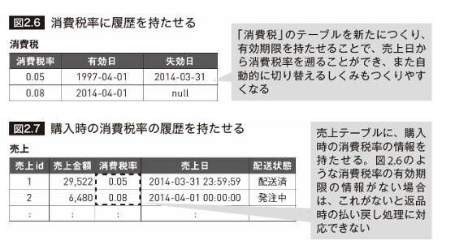
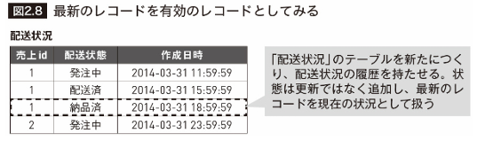
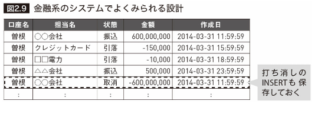
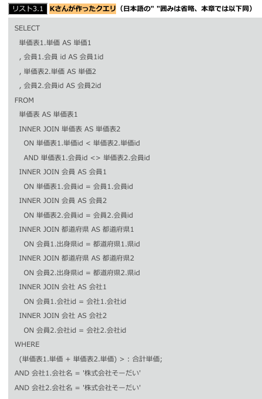
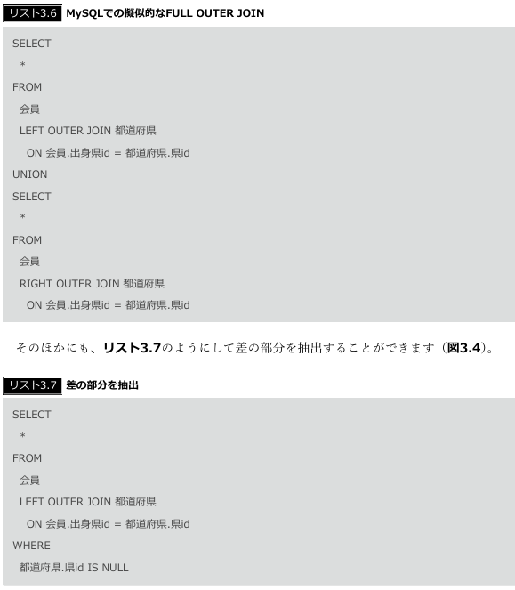
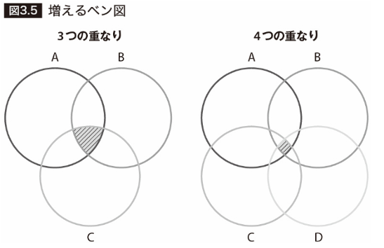

### 1章 データベースの迷宮

### 2章 失われた事実

#### 2.1 アンチパターンの解説

・このデータがどのようにして今の値になったかわからない
・ある⽇を境に売上データと商品マスタの単価データが合わない

消費税率の切り替え⽇で、5%から8%へと消費税率の切り替え作業
 今の設定マスタテーブルの状態
 demo=# SELECT * FROM "設定マスタ" WHERE name = '消費税率';

設定マスタを作っていても過去の履歴を持っていないと、あとあとの取り消し処理で苦労することになります

#### 2.2 似たようなアンチパターン

- 過去の事実（過程）が失われる
途中経過がわからなくなります。
（1）発注済 → キャンセル → 再発注 → 配送済
（2）発注済 → 配送済
の2つは最後の結果のみを⾒ると同じですが、その過程は⼤きく違います

#### 2.3 アンチパターンを⽣まないためには︖

- 消費税率に有効期限を持たせることで商品の購⼊⽇から消費税率の履歴を遡る（図2.6）
- 購⼊商品に利⽤した消費税率を保存し、履歴として持たせる（図2.7）

- 配送状態の問題では、最新のレコードを有効のレコードとしてみる図2.8のような設計

- ⾦融系のシステムでよく使われる処理
  - 削除処理も「打ち消しのINSERT」として保存し、合計値を算出する設計

- 「履歴の保存」はトレードオフ
    - レコードの保存量が増えるためテーブルサイズが増える

#### 2.4 アンチパターンのポイント

- 「後からデータを遡りたいときに事実が失われている設計をしてしまう」
・払い戻しなどの取り消し処理に対応できるか
・配送状況などステータス変化を追えるか
・トラブル対応時、欲しい情報が失われていないか

もしRDBの責務内で履歴を持たない場合
    - 遅延レプリケーションを使う
    - アプリケーションログとしてElasticsearchなどの分析ツールに保存する

#### Column リレーショナルデータモデルと履歴データ

#### Column 遅延レプリケーションについて

- 指定した時間分、スレーブDBに対して、マスタDBからのレプリケーションを遅延させる
    - 1⽇遅れのスレーブDBを作るなど

- マスタDB上で⾏われた誤った作業から保護する
- 「システムのデバッグ時の再現⼿法として使う」場合に利⽤
    - ただし、DBの複製なのでコストは高くなる
    - バックアップは別にとるようにする

### 3章 やり過ぎたJOIN

#### 3.1 アンチパターンの解説

#### 3.2 JOINの特性

- MySQLはFULL OUTER JOINをサポートしていない
    - RIGHT JOINの結果をLEFT JOINの結果とUNIONすることで表現
    - 差の部分を抽出することができます

- JOINの問題点
ベン図が図3.5のように増えていくとどうでしょう？

- JOINの回数が増えると急激に重くなるのがJOINの特徴
  - また、JOINは掛け算と⾔われます
- 100⾏と100⾏のJOINの場合は10,000⾏のテーブルスキャン相当
    - 10,000⾏と10,000⾏ではなんと100,000,000⾏です。
- このように、JOINはSQLの処理の中でもっとも重い処理の1つと⾔える

- RDBで使われるJOINのアルゴリズム
・Nested Loop Join（NLJ）
・Hash Join
・Sort Merge Join

- MySQLはNLJしかサポートしていません
  - PostgreSQLはMySQLに⽐べ、⼤きな2つの表のJOINや不等号を使ったJOINが得意

#### 3.3 アンチパターンを⽣まないためには︖

- JOINを知らずに不⽤意に多段JOINをした
  
#### 3.4 アンチパターンのポイント

#### 4章 効かないINDEX

#### 4.1 アンチパターンの解説

#### 4.2 INDEXの役割

#### 4.3 アンチパターンを⽣まないためには︖

#### 4.4 アンチパターンのポイント

#### Column インデックスショットガン

#### 5章 フラグの闇
#### 5.1 アンチパターンの解説
#### 5.2 とりあえず削除フラグ
#### 5.3 アンチパターンを⽣まないためには︖
#### 5.4 アンチパターンのポイント
#### Column フラグの闇はあとあと効いてくる

#### 6章 ソートの依存
#### 6.1 アンチパターンの解説
#### 6.2 リレーショナルモデルとソートのしくみ
#### 6.3 アンチパターンを⽣まないためには︖
#### 6.4 アンチパターンのポイント
#### Column 実⾏されないとわからないORDER BYの問題
#### Column RDBを補う存在、Redis

#### 7章 隠された状態
#### 7.1 アンチパターンの解説
#### 7.2 似たようなアンチパターン
#### Column EAVの代替案になり得るJSONデータ型
#### 7.3 隠された状態が⽣む問題
#### 7.4 アンチパターンを⽣まないためには︖
#### 7.5 アンチパターンのポイント
#### Column トリガー

#### 8章 JSONの⽢い罠
#### 8.1 アンチパターンの解説
#### 8.2 「なんでもJSON」の危険性
#### 8.3 アンチパターンを⽣まないためには︖
#### 8.4 アンチパターンのポイント
#### Column JSONデータ型のほかの使い道

#### 9章 強過ぎる制約
#### 9.1 アンチパターンの解説
#### 9.2 似たようなアンチパターン
#### 9.3 アンチパターンを⽣まないためには︖
#### 9.4 アンチパターンのポイント
#### Column PostgreSQLの遅延制約

#### 10章 転んだ後のバックアップ
#### 10.1 アンチパターンの解説
#### 10.2 3つのバックアップ
#### 10.3 バックアップ戦略
#### 10.4 アンチパターンを⽣まないためには︖
#### 10.5 アンチパターンのポイント

#### 11章 ⾒られないエラーログ
#### 11.1 アンチパターンの解説
#### 11.2 エラーログの種類
#### 11.3 アンチパターンを⽣まないためには︖
#### 11.4 アンチパターンのポイント
#### Column ログを⾒やすくする⼯夫

#### 12章 監視されないデータベース
#### 12.1 アンチパターンの解説
#### 12.2 ミドルウェアの監視の種類
#### 12.3 アンチパターンを⽣まないためには︖
#### 12.4 アンチパターンのポイント
#### Column 可視化と改善は両輪

#### 13章 知らないロック
#### 13.1 アンチパターンの解説
#### 13.2 ロックの基本
#### 13.3 アンチパターンを⽣まないためには︖
#### 13.4 アンチパターンのポイント

#### 14章 ロックの功罪
#### 14.1 アンチパターンの解説
#### 14.2 トランザクション分離レベル
#### 14.3 アンチパターンを⽣まないためには︖
#### 14.4 アンチパターンのポイント

#### 15章 簡単過ぎる不整合
#### 15.1 アンチパターンの解説
#### 15.2 ⾮正規化の誘惑
#### 15.3 アンチパターンを⽣まないためには︖
#### 15.4 アンチパターンのポイント
#### Column ⾮正規化と履歴データの違い

#### 16章 キャッシュ中毒
#### 16.1 アンチパターンの解説
#### 16.2 キャッシュについて知る
#### 16.3 アンチパターンを⽣まないためには︖
#### 16.4 アンチパターンのポイント

#### 17章 複雑なクエリ
#### 17.1 アンチパターンの解説
#### 17.2 複雑なクエリの発端
#### 17.3 アンチパターンを⽣まないためには︖
#### 17.4 アンチパターンのポイント

#### 18章 ノーチェンジ・コンフィグ
#### 18.1 アンチパターンの解説
#### 18.2 コンフィグを知る
#### 18.3 アンチパターンを⽣まないためには︖
#### 18.4 アンチパターンのポイント

#### 19章 塩漬けのバージョン
#### 19.1 アンチパターンの解説
#### 19.2 なぜバージョンアップは重要なのか
#### 19.3 アンチパターンを⽣まないためには︖
#### 19.4 アンチパターンのポイント

#### 20章 フレームワーク依存症
#### 20.1 アンチパターンの解説
#### 20.2 フレームワークが⽣むメリットとデメリット
#### 20.3 アンチパターンを⽣まないためには︖
#### 20.4 アンチパターンのポイント
