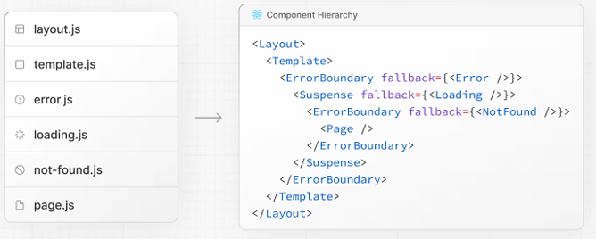
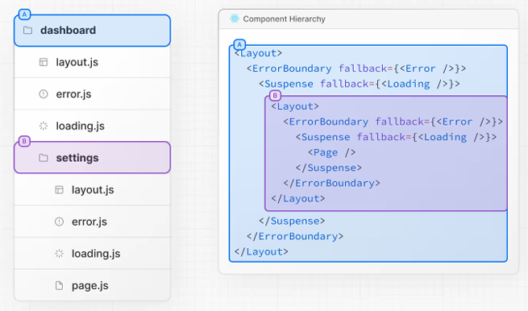
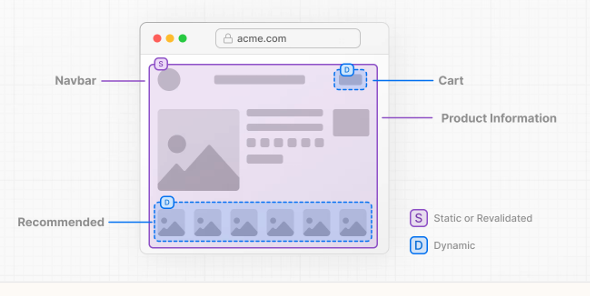

`Next.js`の公式ドキュメントを読んだので、気になったことを中心に簡単な感想や要約を書きます。(網羅性はありません)


---

**サイト**

- <a href="https://nextjs.org/docs/">公式</a>

---

### 1.インストール

#### システム要件

#### 自動インストール

#### 手動インストール

- `pnpm i next@latest react@latest react-dom@latest`
- `next dev, build, start, lint`

##### アプリ ディレクトリを作成する

- layout.tsxは必須で、html, bodyタグを含める必要
- 作成せず、`next dev`を実行すると自動で作成される

##### パブリック フォルダーを作成する (省略可能)

- /で参照できる

#### 開発サーバーを実行する

#### TypeScript を設定する

##### IDEプラグイン

#### ESLint のセットアップ

- `npm run lint`
    - strice, base, cancelのオプションが表示
    - strict
        - Core Web Vitalsが含まれる、推奨
        - `.eslintrc.json`が作成される
    - cancel
        - 独自の場合
    - 毎回のビルドでも自動で実行される

#### 絶対インポートとモジュールパスエイリアスの設定

- `tsconfig.json`, `jsconfig.json`で`baseUrl`を設定
- `paths`でエイリアスも設定
```yaml
"compilerOptions": {
  "baseUrl": "src/",
  "paths": {
    "@/styles/*": ["styles/*"],
    "@/components/*": ["components/*"]
  }
}
```

### 2.プロジェクトの構造

#### フォルダとファイルの規則

##### 最上位フォルダ

##### トップレベルファイル
    
- `next.config.js`
- `instrumentation.ts`
    - Opentelemetory

##### ルーティングファイル

- `global-error.tsx`
- `template.tsx`
    - 再レンダリングされる
- `default.tsx`
    - 並列ルートフォールバックパッケージ

##### ネストされたルート

##### 動的ルート

- `[folder]`
    - 動的ルート
- `[...folder]`
    - 包括的
- `[[...folder]]`
    - オプション、包括

##### ルートグループ、プライベート

- `(folder)`
    - ルーティングに影響を与えず、グループ化
- `_folder`
    - ルーティングから除外

##### 並行ルートと傍受ルート

- `@folder`
    - 名前付きスロット
- `(.)folder`
    - 同じレベルでインターセプト
- `(..)folder`
    - 1つ上のレベルをインターセプト
- `(..)(..)folder`
    - 2レベル上でインターセプト
- `(...)folder`
    - ルートからのインターセプト

##### メタデータファイルの規則

###### アプリアイコン

- `favicon.ico`
- `icon.ts, tsx`
- `apple-icon.ts, tsx`

###### Open GraphとTwitterの画像

- `opengraph-image.ts, tsx`
- `twitter-image.ts, tsx`

###### SEO

- `sitemap.ts`
    - xmlが生成される
- `robots.ts`

#### プロジェクトの整理

##### コンポーネント階層



- 再帰的にレンダリングされる(ネスト)



##### コロケーション

##### プライベートフォルダ

- デフォルトで安全に共存できるので基本的に不要
- フォルダの前に`%5F`
    - アンダースコアで始まる

##### ルートグループ

```plaintext
- (admin)
    - dashboard
- (marketing)
    - about
```
- サイトのセクションやチーム別にルートを整理できる

##### srcフォルダ

#### 例

##### プロジェクトファイルをアプリの外部に保存する

##### プロジェクトファイルをアプリ内の最上位フォルダに保存する

##### プロジェクトファイルを機能またはルートごとに分割する

##### URLパスに影響を与えずにルートを整理する

##### 特定のセグメントをレイアウトに組み込む

##### 特定のルートでスケルトンをロードすることを選択する

- 新しいルートグループを作成し、`loading.tsx`を移動

```plaintext
- (overview)
    - loading.tsx
    - ...
```

##### 複数のルートレイアウトを作成する

- 最上位の`layout.tsx`を削除し、各ルートグループに配置


### 3.レイアウトとページ

#### ページの作成

#### レイアウトの作成

- レイアウトは状態を保持、インタラクティブ性を維持、再レンダリングを行わない

#### ネストされたルートの作成

- `app/blog/[slug]/page.tsx`

```ts
export function generateStaticParams() {
}

export default function Page() {
  return <h1>Hello, Blog Post Page!</h1>;
}
```

#### ネストレイアウト

#### 動的セグメントの作成

```ts
export default async function BlogPostPage({
  params,
}: {
  params: Promise<{ slug: string }>;
}) {
  const { slug } = await params;
  const post = await getPost(slug);

  return (
    <div>
      <h1>{post.title}</h1>
      <p>{post.content}</p>
    </div>
  );
}
```

#### ページ間のリンク

- Linkコンポーネント
    - プリフェッチ、クライアント側ナビゲーションを追加
    - `import Link from 'next/link'`
    - より高度な遷移は`useRouter`を使う


### 4.リンクとナビゲーション

- ナビゲーションの高速性が大切
    - プリフェッチ、ストリーミング、クライアントサイドトランジション
    - 動的ルート、低速ネットワークでの高速化   

#### ナビゲーションの仕組み

##### サーバーレンダリング

- 事前レンダリングはビルド時、再検証時に行われ、キャッシュされる

##### プリフェッチ

- Linkコンポーネントがビューポイントに入った時点で実行
- 静的ルート
    - 完全にプリフェッチ
- 動的ルート
    - `loading.tsx`が存在する場合に部分的にプリフェッチ
    - ストリーミングが重要

##### ストリーミング

- 準備が整い次第、一部をクライアントに送信
- `loading.tsx`を使用すると、page.tsxを<Suspense>境界で⾃動的に囲む

##### クライアント側の遷移

- ページを移動すると、ページ全体が読み込まれる
    - 状態のクリア、スクロールのリセットなどの問題
- Linkでクライアント側での遷移で対処

#### 遷移が遅くなる原因は何でしょうか?

##### loading.tsxの動的ルート.tsx

- Next.js Devtools を使⽤してルートが静的か動的かを識別できる
- devIndicators

##### generateStaticParams のない動的セグメント

```ts
export async function generateStaticParams() {
  const posts = await fetch('https://.../posts').then((res) => res.json())
 
  return posts.map((post) => ({
    slug: post.slug,
  }))
}
 
export default async function Page({
  params,
}: {
  params: Promise<{ slug: string }>
}) {
  const { slug } = await params
  // ...
}
```

##### 遅いネットワーク

- リンクをクリックする前に、プリフェッチが完了しない場合
    - `loading.tsx`が表示されない
- 遷移中に`useLinkStatus`フックを使用

```tsx
'use client'
 
import { useLinkStatus } from 'next/link'
 
export default function LoadingIndicator() {
  const { pending } = useLinkStatus()
  return pending ? (
    <div role="status" aria-label="Loading" className="spinner" />
  ) : null
}
```

- 上記をデバウンスする場合
    - 指定の遅延よりも長い場合にのみ表示
    - animationの100ミリ秒の遅延、非表示で開始

```css
.spinner {
  /* ... */
  opacity: 0;
  animation:
    fadeIn 500ms 100ms forwards,
    rotate 1s linear infinite;
}
 
@keyframes fadeIn {
  from {
    opacity: 0;
  }
  to {
    opacity: 1;
  }
}
 
@keyframes rotate {
  to {
    transform: rotate(360deg);
  }
}
```

##### プリフェッチを無効にする

- 膨大なリンクリストをレンダリングする際などにリソースの無駄な消費を避ける

```tsx
<Link prefetch={false} href="/blog">Link</Link>
```
- クリック時のみ取得される
- ホバー時のみプリフェッチを行う場合

```tsx
'use client'
 
import Link from 'next/link'
import { useState } from 'react'
 
function HoverPrefetchLink({
  href,
  children,
}: {
  href: string
  children: React.ReactNode
}) {
  const [active, setActive] = useState(false)
 
  return (
    <Link
      href={href}
      prefetch={active ? null : false}
      onMouseEnter={() => setActive(true)}
    >
      {children}
    </Link>
  )
}
```

##### 水分補給が完了していません

- Linkはクライアントコンポーネント
    - プリフェッチ前にハイドレートの必要
    - JSファイルが大きいと、ハイドレートが遅れ、プリフェッチが開始されない場合
        - `next/bundle-analyzer`プラグインを使⽤
        - ロジックをサーバ側へ移動

#### 例

##### ネイティブ履歴API

###### window.history.pushState

- 前の状態に戻れる
```ts
import { useSearchParams } from 'next/navigation'
```

###### window.history.replaceState

- 前の状態に戻れない
- アプリのロケールを切り替える場合などに使用
```ts
import { usePathname } from 'next/navigation'
```

### 5.サーバーおよびクライアントコンポーネント

#### サーバー コンポーネントとクライアント コンポーネントはいつ使用すればよいですか?

- サーバーコンポーネント
    - JS量の削減
    - First Contentful Paint（FCP）の改善

#### Next.js ではサーバー コンポーネントとクライアント コンポーネントはどのように機能しますか?

##### サーバー上

- サーバーコンポーネント
    - RSC ペイロードという特別なデータ形式でレンダリングされる

##### クライアント側（最初の読み込み）

- HTML→RSCペイロード→JSはクライアントコンポーネントをハイドレート

##### その後のナビゲーション

#### 例

##### クライアントコンポーネントの使用

##### JSバンドルサイズの削減

- CSR以外はサーバーコンポーネントにする

##### サーバーからクライアントコンポーネントへのデータの受け渡し

- useフックを使うこともできる

##### サーバーとクライアントのコンポーネントのインターリーブ

##### コンテキストプロバイダー

##### サードパーティコンポーネント

- `useState`などを使うライブラリの場合
    - サーバーコンポーネントで直接使うとエラー

```tsx
'use client'
 
import { Carousel } from 'acme-carousel'
 
export default Carousel
```

- ライブラリ開発者は、エントリポイントに`use client`を追加
    - ユーザーはラッパーを作成する必要がなくなる
    - これを含める`esbuild`の設定例も確認できる

##### 環境汚染の防止

- `NEXT_PUBLIC_`がついていない環境変数は空文字に置き換えられる
- 誤使用を防ぐために、`server-only`パッケージを使用

```tsx
import 'server-only'
 
export async function getData() {
  const res = await fetch('https://external-service.com/data', {
    headers: {
      authorization: process.env.API_KEY,
    },
  })
 
  return res.json()
}
```
- `client-only`パッケージもある
- `pnpm add server-only`でインストール
- TSの`noUncheckedSideEffectImports`が存在しない場合
    - 独自の型宣言も提供


### 6.部分的な事前レンダリング

- PRRは同じルートで静的、動的コンテンツを組み合わせる手法


- 静的コンテンツのシェルを送信、動的ホールは並列にストリーミングされる

#### 部分的な事前レンダリングはどのように機能しますか?

##### 静的レンダリング

- 静的シェルは事前レンダリングされ、キャッシュされる

##### ダイナミックレンダリング

- 以下を使用する場合、動的になる
- cookies
- headers
- connection
- draftMode
- searchParamsプロパティ
- unstable_noStore
- { cache: 'no-store' }でfetch

##### サスペンス

- 動的な境界をマークするために使用

##### ストリーミング

- チャンクに分割し、段階的にストリーミング

#### 部分的な事前レンダリングを有効にする

- `next.config.ts`

```ts
import type { NextConfig } from 'next'
 
const nextConfig: NextConfig = {
  experimental: {
    ppr: 'incremental',
  },
}
 
export default nextConfig
```
- `.../layout.tsx`

```tsx
 export const experimental_ppr = true
 ...
```
- 上記はルートの最上位セグメントにのみ追加
- 子でPRRを無効にするには、`experimental_prr=false`

#### 例

##### 動的API

```tsx
import { Suspense } from 'react'
import { User, AvatarSkeleton } from './user'
 
export const experimental_ppr = true
 
export default function Page() {
  return (
    <section>
      <h1>This will be prerendered</h1>
      <Suspense fallback={<AvatarSkeleton />}>
        <User />
      </Suspense>
    </section>
  )
}
```

##### 動的プロップを渡す

- `page.tsx`

```tsx
import { Table, TableSkeleton } from './table'
import { Suspense } from 'react'
 
export default function Page({
  searchParams,
}: {
  searchParams: Promise<{ sort: string }>
}) {
  return (
    <section>
      <h1>This will be prerendered</h1>
      <Suspense fallback={<TableSkeleton />}>
        <Table searchParams={searchParams} />
      </Suspense>
    </section>
  )
}
```
- `table.tsx`

```tsx
export async function Table({
  searchParams,
}: {
  searchParams: Promise<{ sort: string }>
}) {
  const sort = (await searchParams).sort === 'true'
  return '...'
}
```


### 7.データの取得

- サーバー コンポーネントとクライアント コンポーネントでデータを取得する⽅法
- データに依存するコンポーネントをストリーミングする⽅法

#### データの取得

##### サーバーコンポーネント

- 以下の2通り

###### フェッチAPIを使用

- fetchでデフォルトではキャッシュされない
- 動的レンダリングを有効にするには、`{ cache: 'no-store' }`
- 開発時は、fetch呼び出しをログに記録できる

###### ORMまたはデータベースを使用

##### クライアントコンポーネント

- 以下の2通り

###### useフックを使ったデータのストリーミング

```tsx
import Posts from '@/app/ui/posts
import { Suspense } from 'react'
 
export default function Page() {
  // Don't await the data fetching function
  const posts = getPosts()
 
  return (
    <Suspense fallback={<div>Loading...</div>}>
      <Posts posts={posts} />
    </Suspense>
  )
}
```
```tsx
'use client'
import { use } from 'react'
 
export default function Posts({
  posts,
}: {
  posts: Promise<{ id: string; title: string }[]>
}) {
  const allPosts = use(posts)
 
  return (
    <ul>
      {allPosts.map((post) => (
        <li key={post.id}>{post.title}</li>
      ))}
    </ul>
  )
}
```

###### コミュニティライブラリ

```tsx
'use client'
import useSWR from 'swr'
 
const fetcher = (url) => fetch(url).then((r) => r.json())
 
export default function BlogPage() {
  const { data, error, isLoading } = useSWR(
    'https://api.vercel.app/blog',
    fetcher
  )
 
  if (isLoading) return <div>Loading...</div>
  if (error) return <div>Error: {error.message}</div>
  ...
```

#### React.cache によるリクエストの重複排除

- 異なるコンポーネントで同じデータを取得できる
- `cache: 'force-cache'`を追加

```tsx
import { cache } from 'react'
import { db, posts, eq } from '@/lib/db'
 
export const getPost = cache(async (id: string) => {
  const post = await db.query.posts.findFirst({
    where: eq(posts.id, parseInt(id)),
  })
})
```

#### ストリーミング

- アプリケーションでdynamicIO設定が有効になっていることを前提
- 遅いリクエストがある場合、ページ全体がブロックされる

##### loading.js を使用

##### Suspenseでラップ

- より細かく制御できる

##### 意味のある読み込み状態の作成

#### 例

##### シーケンシャルデータフェッチ

- 独自データのfetch、重複排除されない場合

```tsx
export default async function Page({
  params,
}: {
  params: Promise<{ username: string }>
}) {
  const { username } = await params
  // Get artist information
  const artist = await getArtist(username)
 
  return (
    <>
      <h1>{artist.name}</h1>
      {/* Show fallback UI while the Playlists component is loading */}
      <Suspense fallback={<div>Loading...</div>}>
        {/* Pass the artist ID to the Playlists component */}
        <Playlists artistID={artist.id} />
      </Suspense>
    </>
  )
}
 
async function Playlists({ artistID }: { artistID: string }) {
}
```

##### 並列データフェッチ

```tsx
import { getArtist, getAlbums } from '@/app/lib/data'
 
export default async function Page({ params }) {
  // These requests will be sequential
  const { username } = await params
  const artist = await getArtist(username)
  const albums = await getAlbums(username)
  return <div>{artist.name}</div>
}
```
- 上記は`Promise.all`を使うといい

```tsx
  const artistData = getArtist(username)
  const albumsData = getAlbums(username)
 
  // Initiate both requests in parallel
  const [artist, albums] = await Promise.all([artistData, albumsData])
```
- `Promise.allSettled`を使えば、一個のリクエストが失敗しても全体は失敗しない

##### データのプリロード

- ユーティリティ関数`preload()`を作成

```tsx
import { getItem } from '@/lib/data'
 
export default async function Page({
  params,
}: {
  params: Promise<{ id: string }>
}) {
  const { id } = await params
  // starting loading item data
  preload(id)
  // perform another asynchronous task
  const isAvailable = await checkIsAvailable()
 
  return isAvailable ? <Item id={id} /> : null
}
 
export const preload = (id: string) => {
  void getItem(id)
}

export async function Item({ id }: { id: string }) {
  const result = await getItem(id)
  // ...
}
```

### 8.データの更新

#### サーバー機能とは何ですか?

- サーバーアクションは`startTransition`で使⽤される
- キャッシュアーキテクチャと統合

#### サーバー関数の作成

- `use server`を非同期関数の先頭に書く
- ファイルの先頭の場合、全ての関数に適用

```tsx
export async function createPost(formData: FormData) {
  'use server'
  const title = formData.get('title')
  const content = formData.get('content')
 
  // Update data
  // Revalidate cache
}
 
export async function deletePost(formData: FormData) {
  'use server'
  const id = formData.get('id')
 
  // Update data
  // Revalidate cache
}
```

##### サーバーコンポーネント

- インライン化できる

```tsx
export default function Page() {
  // Server Action
  async function createPost(formData: FormData) {
    'use server'
    // ...
  }
 
  return <></>
}
```
- プログレッシブエンハンスメントをサポート
    - JSが読み込まれていない、無効な場合でも、サーバーアクションを呼び出せる

##### クライアントコンポーネント

```tsx
'use client'
 
import { createPost } from '@/app/actions'
 
export function Button() {
  return <button formAction={createPost}>Create</button>
}
```

##### アクションをプロパティとして渡す

```tsx
<ClientComponent updateItemAction={updateItem} />
```
```tsx
'use client'
 
export default function ClientComponent({
  updateItemAction,
}: {
  updateItemAction: (formData: FormData) => void
}) {
  return <form action={updateItemAction}>{/* ... */}</form>
}
```

#### サーバー関数の呼び出し

- 以下の2通り

##### フォーム

```tsx
import { createPost } from '@/app/actions'
 
export function Form() {
  return (
    <form action={createPost}>
      <input type="text" name="title" />
      <input type="text" name="content" />
      <button type="submit">Create</button>
    </form>
  )
}
```
```tsx
'use server'
 
export async function createPost(formData: FormData) {
  const title = formData.get('title')
  const content = formData.get('content')
 
  // Update data
  // Revalidate cache
}
```

##### イベントハンドラー

```tsx
      <button
        onClick={async () => {
          const updatedLikes = await incrementLike()
          setLikes(updatedLikes)
        }}
      >
        Like
      </button>
```

#### 例

##### 保留状態を表示

- `useActionState` を使⽤して読み込みインジケーターを表⽰

```tsx
'use client'
 
import { useActionState, startTransition } from 'react'
import { createPost } from '@/app/actions'
import { LoadingSpinner } from '@/app/ui/loading-spinner'
 
export function Button() {
  const [state, action, pending] = useActionState(createPost, false)
 
  return (
    <button onClick={() => startTransition(action)}>
      {pending ? <LoadingSpinner /> : 'Create Post'}
    </button>
  )
}
```

##### 再検証

- Server Function 内で`revalidatePath` または`revalidateTag` を呼び出す
- キャッシュを再検証し、更新されたデータを表示

```tsx
import { revalidatePath } from 'next/cache'
 
export async function createPost(formData: FormData) {
  'use server'
  // Update data
  // ...
 
  revalidatePath('/posts')
}
```

##### リダイレクト

```tsx
 import { redirect } from 'next/navigation'
```

##### クッキー

```tsx
'use server'
 
import { cookies } from 'next/headers'
 
export async function exampleAction() {
  const cookieStore = await cookies()
 
  // Get cookie
  cookieStore.get('name')?.value
 
  // Set cookie
  cookieStore.set('name', 'Delba')
 
  // Delete cookie
  cookieStore.delete('name')
}
```

##### useEffect

```tsx
'use client'
 
import { incrementViews } from './actions'
import { useState, useEffect, useTransition } from 'react'
 
export default function ViewCount({ initialViews }: { initialViews: number }) {
  const [views, setViews] = useState(initialViews)
  const [isPending, startTransition] = useTransition()
 
  useEffect(() => {
    startTransition(async () => {
      const updatedViews = await incrementViews()
      setViews(updatedViews)
    })
  }, [])
 
  // You can use `isPending` to give users feedback
  return <p>Total Views: {views}</p>
}
```


### 9.キャッシュと再検証

#### フェッチ

```tsx
const data = await fetch('https://...', { cache: 'force-cache' })
```

- 動的であることを保証したい場合は、`connectionAPI`を使用
- 再検証

```tsx
const data = await fetch('https://...', { next: { revalidate: 3600 } })
```

#### unstable_cache

```tsx
import { unstable_cache } from 'next/cache'
import { getUserById } from '@/app/lib/data'
 
export default async function Page({
  params,
}: {
  params: Promise<{ userId: string }>
}) {
  const { userId } = await params
 
  const getCachedUser = unstable_cache(
    async () => {
      return getUserById(userId)
    },
    [userId] // add the user ID to the cache key
  )
}
```
- `tags`, `revalidate`オプション

```tsx
const getCachedUser = unstable_cache(
  async () => {
    return getUserById(userId)
  },
  [userId],
  {
    tags: ['user'],
    revalidate: 3600,
  }
)
```

#### revalidateTag

- タグとイベントに基づいてキャッシュを再検証

```tsx
export async function getUserById(id: string) {
  const data = await fetch(`https://...`, {
    next: {
      tags: ['user'],
    },
  })
}
```

- サーバーアクションなどで呼び出す

```tsx
import { revalidateTag } from 'next/cache'
 
export async function updateUser(id: string) {
  // Mutate data
  revalidateTag('user')
}
```

#### revalidatePath

```tsx
import { revalidatePath } from 'next/cache'
 
export async function updateUser(id: string) {
  // Mutate data
  revalidatePath('/profile')
```


### 10.エラー処理

- 予想されるエラー、キャッチされないエラー

#### 予想されるエラーの処理

##### サーバーアクション

- useActionStateを使う
    - サーバーアクションで予想されるエラーを処理
- try, catchやエラーのスローは避ける

```tsx
'use server'
 
export async function createPost(prevState: any, formData: FormData) {
  const title = formData.get('title')
  const content = formData.get('content')
 
  const res = await fetch('https://api.vercel.app/posts', {
    method: 'POST',
    body: { title, content },
  })
  const json = await res.json()
 
  if (!res.ok) {
    return { message: 'Failed to create post' }
  }
}
```

```tsx
'use client'
 
import { useActionState } from 'react'
import { createPost } from '@/app/actions'
 
const initialState = {
  message: '',
}
 
export function Form() {
  const [state, formAction, pending] = useActionState(createPost, initialState)
 
  return (
    <form action={formAction}>
      <label htmlFor="title">Title</label>
      <input type="text" id="title" name="title" required />
      <label htmlFor="content">Content</label>
      <textarea id="content" name="content" required />
      {state?.message && <p aria-live="polite">{state.message}</p>}
      <button disabled={pending}>Create Post</button>
    </form>
  )
}
```

##### サーバーコンポーネント

##### not-found

- ルートで`notFound`関数を呼び出す
    - `not-found.js`が表示される

```tsx
  if (!post) {
    notFound()
  }
```

```tsx
export default function NotFound() {
  return <div>404 - Page Not Found</div>
}
```

#### キャッチされない例外の処理

- エラーバウンダリによってキャッチされる

##### ネストされたエラーバウンダリ

- `error.tsx`の作成

```tsx
'use client' // Error boundaries must be Client Components
 
import { useEffect } from 'react'
 
export default function Error({
  error,
  reset,
}: {
  error: Error & { digest?: string }
  reset: () => void
}) {
  useEffect(() => {
    // Log the error to an error reporting service
    console.error(error)
  }, [error])
 
  return (
    <div>
      <h2>Something went wrong!</h2>
      <button
        onClick={
          // Attempt to recover by trying to re-render the segment
          () => reset()
        }
      >
        Try again
      </button>
    </div>
  )
}
```

##### グローバルエラー

- あまり一般的ではない
- `global-error.tsx`ファイルを使⽤


### 11.CSS

#### CSS モジュール

- `.module.css`

#### グローバルCSS

- `app/global.css`を`app/layout.tsx`でインポート

#### 外部スタイルシート

#### 順序付けとマージ

- NextはCSSを自動的にマージし、ビルドでCSSを最適化

##### 推奨 事項

#### 開発 vs 生産

#### 次のステップ


### 12.画像の最適化

- `<Image>`コンポーネントの特徴
  - デバイスに応じたサイズの最適化 
  - 遅延読み込みを使用し、ビューポイントに入ったときに読み込み
  - オプションでぼかしのプレースホルダーも使用できる

#### ローカル画像

- 自動的に`width`, `height`を決定

```tsx
import Image from 'next/image'
import ProfileImage from './profile.png'
 
export default function Page() {
  return (
    <Image
      src={ProfileImage}
      alt="Picture of the author"
      // width={500} automatically provided
      // height={500} automatically provided
      // blurDataURL="data:..." automatically provided
      // placeholder="blur" // Optional blur-up while loading
    />
  )
}
```

#### リモートイメージ

- width、height、blurDataURLプロパティを⼿動で指定する必要
- 読み込み時のレイアウトのずれを防ぐために使用される
- あるいは`fill`プロパティ
  - 画像を親要素のサイズに合わせて埋め込む

- 安全に外部から読み込むには`next.config.js`でURLパターンを設定
  - できるだけ具体的に指定

```ts
import type { NextConfig } from 'next'
 
const config: NextConfig = {
  images: {
    remotePatterns: [
      {
        protocol: 'https',
        hostname: 's3.amazonaws.com',
        port: '',
        pathname: '/my-bucket/**',
        search: '',
      },
    ],
  },
}
 
export default config
```


### 13.フォントの最適化

- フォントを自動的に最適化し、ネットワーク要求を削除
- セルフホスティング機能をサポート
- `next/font/local`または`next/font/google`からインポート
- `app/layout.tsx`

```tsx
import { Geist } from 'next/font/google'
 
const geist = Geist({
  subsets: ['latin'],
})
 
export default function Layout({ children }: { children: React.ReactNode }) {
  return (
    <html lang="en" className={geist.className}>
      <body>{children}</body>
    </html>
  )
}
```

#### Googleフォント

- Google Fonts は⾃動的にセルフホストできる

```ts
import { Geist } from 'next/font/google'
```
- 可変フォントの使用がいい
  - パフォーマンスと柔軟性
  - 使用できない場合、太さを指定する必要

```ts
import { Roboto } from 'next/font/google'
 
const roboto = Roboto({
  weight: '400',
  subsets: ['latin'],
})
```

#### ローカルフォント

- `next/font/local`からフォントをインポートし、ローカルフォントファイルのsrcを指定
- `public`フォルダ、`app`フォルダに配置

```ts
import localFont from 'next/font/local'
 
const myFont = localFont({
  src: './my-font.woff2',
})
```

- 複数の場合は、`src`を配列する

```ts
const roboto = localFont({
  src: [
    {
      path: './Roboto-Regular.woff2',
      weight: '400',
      style: 'normal',
    },
    {
      path: './Roboto-Italic.woff2',
      weight: '400',
      style: 'italic',
    },
  ],
})
```


### 14.メタデータとOGイメージ

- 静的`metadata`オブジェクト
- 動的`generateMetadata`関数
- favicon, og-imageを作成するファイル
- 上記は、`<head>`タグを自動的に生成

#### デフォルトフィールド

```html
<meta charset="utf-8" />
<meta name="viewport" content="width=device-width, initial-scale=1" />
```

#### 静的メタデータ

- layout.js,page.jsからMetadata オブジェクトをエクスポート
- `app/blog/layout.tsx`

```tsx
import type { Metadata } from 'next'
 
export const metadata: Metadata = {
  title: 'My Blog',
  description: '...',
}
 
export default function Page() {}
```

#### 生成されたメタデータ

- 以下では特定のポストのタイトルと説明を取得

```tsx
import type { Metadata, ResolvingMetadata } from 'next'
 
type Props = {
  params: Promise<{ slug: string }>
  searchParams: Promise<{ [key: string]: string | string[] | undefined }>
}
 
export async function generateMetadata(
  { params, searchParams }: Props,
  parent: ResolvingMetadata
): Promise<Metadata> {
  const slug = (await params).slug
 
  // fetch post information
  const post = await fetch(`https://api.vercel.app/blog/${slug}`).then((res) =>
    res.json()
  )
 
  return {
    title: post.title,
    description: post.description,
  }
}
 
export default function Page({ params, searchParams }: Props) {}
```

##### メタデータのストリーミング

- generateMetadataを解決するとレンダリングがブロックされ
る可能性がある場合
  -Nextは解決されたメタデータを個別にストリーミングし、準備ができ次第HTML に挿⼊

##### データ要求のメモ化

- メタデータとページ⾃体に同じデータを取得する必要がある場合
  - cache機能の利用

```tsx
import { cache } from 'react'
import { db } from '@/app/lib/db'
 
// getPost will be used twice, but execute only once
export const getPost = cache(async (slug: string) => {
  const res = await db.query.posts.findFirst({ where: eq(posts.slug, slug) })
  return res
})
```

```tsx
import { getPost } from '@/app/lib/data'
 
export async function generateMetadata({
  params,
}: {
  params: { slug: string }
}) {
  const post = await getPost(params.slug)
  return {
    title: post.title,
    description: post.description,
  }
}
 
export default async function Page({ params }: { params: { slug: string } }) {
  const post = await getPost(params.slug)
  return <div>{post.title}</div>
}
```

#### ファイルベースのメタデータ

- favicon.ico、apple-icon.jpg、icon.jpg
- opengraph-image.jpg と twitter-image.jpg
- robots.txt
- sitemap.xml

#### ファビコン

- ルートに`favicon.ico`を作成

#### 静的オープングラフ画像

- SNSで表現される画像

#### 生成されたOpen Graph画像

- ImageResponseコンストラクタを使⽤
  - JSXとCSSを使⽤して動的な画像を⽣成
- `app/blog/[slug]/opengraph-image.ts`

```ts
import { ImageResponse } from 'next/og'
import { getPost } from '@/app/lib/data'
 
// Image metadata
export const size = {
  width: 1200,
  height: 630,
}
 
export const contentType = 'image/png'
 
// Image generation
export default async function Image({ params }: { params: { slug: string } }) {
  const post = await getPost(params.slug)
 
  return new ImageResponse(
    (
      // ImageResponse JSX element
      <div
        style={{
          fontSize: 128,
          background: 'white',
          width: '100%',
          height: '100%',
          display: 'flex',
          alignItems: 'center',
          justifyContent: 'center',
        }}
      >
        {post.title}
      </div>
    )
  )
}
```
- ImageResponse は@vercel/og を使⽤


### 15.ルートハンドラとミドルウェア

#### ルートハンドラー

##### 慣習

- `app/api/route.ts`

```ts
export async function GET(request: Request) {}
```

##### サポートされているHTTPメソッド

- メソッドはGET、POST、PUT、PATCH、DELETE、HEAD、OPTIONS

##### 拡張された NextRequest および NextResponse API

##### キャッシング

- GETメソッドのキャッシュを有効にすることができます
- `export const dynamic = 'force-static'`

```ts
export const dynamic = 'force-static'
 
export async function GET() {
  const res = await fetch('https://data.mongodb-api.com/...', {
    headers: {
      'Content-Type': 'application/json',
      'API-Key': process.env.DATA_API_KEY,
    },
  })
  const data = await res.json()
 
  return Response.json({ data })
}
```
- 他のメソッドはキャッシュされない

##### 特別なルートハンドラー

- `sitemap.ts`、`opengraph-image.tsx`、`icon.tsx`など

##### ルート解決

#### ミドルウェア

- ヘッダーの書き換え、リダイレクト、変更、直接レスポンスを返す

##### ユースケース

- A/Bテストや実験に基づいて異なるページに書き換えるなど

##### 慣習

- ミドルウェアの複数ファイルの分割も可能
- ルートでインポート

##### 例

```tsx
import { NextResponse } from 'next/server'
import type { NextRequest } from 'next/server'
 
// This function can be marked `async` if using `await` inside
export function middleware(request: NextRequest) {
  return NextResponse.redirect(new URL('/home', request.url))
}
 
// See "Matching Paths" below to learn more
export const config = {
  matcher: '/about/:path*',
}
```


### 16.デプロイ

- nodejs, docker, adapter

#### Node.jsサーバー

##### テンプレート

#### ドッカー

- ただし、ローカルでは`npm run dev`を使用

##### テンプレート

#### 静的エクスポート

- NextをSPAとして開始する例
- サーバ機能はサポートされない

##### テンプレート

#### アダプター

- プラットフォーム依存
- Amplify Hosting, Cloudflare, Netlify, Vercel


### 17.アップグレード

#### 最新バージョン

- `npx @next/codemod@latest upgrade latest`

#### カナリア版

- `npm i next@canary`

##### カナリアで利用可能な機能

- キャッシュ:
  - "use cache"
  - cacheLife
  - cacheTag
  - dynamicIO
- 認証:
  - forbidden
  - unauthorized
  - forbidden.js
  - unauthorized.js
  - authInterrupts

  